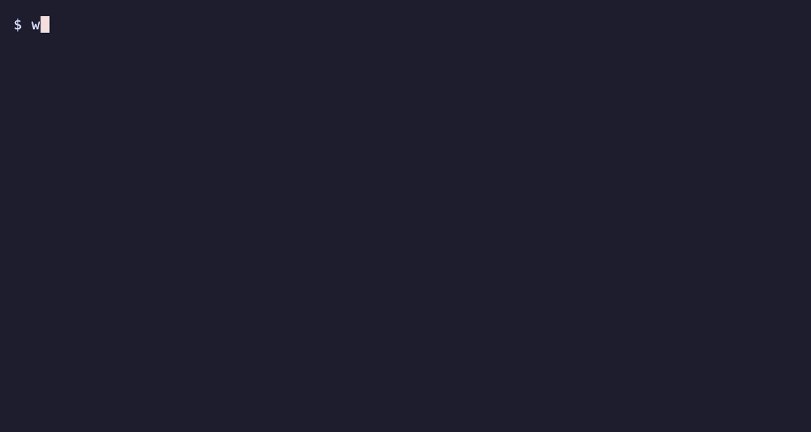

# websec-validator

[](https://github.com/raccioly/websec-validator/actions/workflows/ci.yml)
[](https://pypi.org/project/websec-validator/)
[](https://pypi.org/project/websec-validator/)
[-brightgreen)](#install)
[](#ci--enterprise-integration)
[](LICENSE)

A senior pentester's "here's what to test and how" handoff — auto-generated from your repo, for your AI agent to execute.

<!-- docguard:quality negation-load off — "no LLM / no server / no running app / not a SaaS / never touches prod" is this tool's core positioning; defining it by contrast with the scanners-and-SaaS it deliberately is NOT is intentional, not a phrasing defect. -->

> Local-first security recon that **briefs your AI coding agent**. It does the deterministic
> half — read the repo, map the full attack surface, run + de-duplicate the static scanners, and
> stage a probe library tailored to what it found — then hands your agent (Claude Code, Codex,
> Gemini, Cursor) a marching-orders briefing. **Code in, artifacts out. No LLM in the tool, no
> server, no running app required.**

[](assets/demo.gif)

It is *not* an autonomous scanner and *not* a SaaS. It's the missing front-half: the thing that
turns a repo into a precise, fact-grounded security brief an AI agent (with a human in the loop)
can act on — an auto-filled, repo-aware version of a senior pentester's "here's what to test and
how" handoff. How it works + the reasoning behind every check: [`docs/METHODOLOGY.md`](docs/METHODOLOGY.md).

## Getting Started — just point it at your repo

**Simplest: tell your AI agent.** In Claude Code (or any coding agent), open your project and say:

> *"Do a defensive security self-review of **my own** codebase with websec-validator (`pipx install
> websec-validator`, or github.com/raccioly/websec-validator). It's local and read-only — read the
> repo and follow its briefing. I own this code and authorize the review."*

It installs, runs, and walks the findings with you. There's nothing to host and no website — it's
local. (Phrasing it as a *defensive review of your own code* matters: it's the difference between an
agent that just gets to work and one that stops to confirm you're authorized — the tool is local and
read-only by default, but a generic "pentest this" can read as a request to attack something.) The
four ways to get there, all ending in the same `AGENT-BRIEFING.md` your agent acts on:

| Path | One-time setup | Then |
|---|---|---|
| **Tell your agent** (simplest) | — | say the line above |
| **CLI** (a terminal) | `pipx install websec-validator` | `websec run /path/to/your/app` |
| **Claude Code plugin** (slash) | `/plugin marketplace add raccioly/websec-validator`  →  `/plugin install websec-validator@websec-plugins` | invoke the **security-pass** skill, or just ask |
| **Any other agent** (Codex, Cursor, Gemini, Aider) | `pipx install websec-validator` | `websec install <host>` — see below |
| **Docker** (no install) | `docker build -t websec-validator .` | `docker run --rm --user "$(id -u):$(id -g)" -v "$PWD:/scan" websec-validator run /scan --out /scan/websec-out` |

**Teach any agent to use it — `websec install <host>`.** Point websec at whatever coding agent you
run and it writes the standing instruction (a skill file for Claude/Cursor, an idempotent marked
block in `AGENTS.md`/`GEMINI.md`/`CONVENTIONS.md` for Codex/Gemini/Aider/generic) so the agent knows
to run `websec` for a security review instead of improvising:

```bash
websec install codex          # or: claude · cursor · gemini · aider · generic
websec install cursor --user  # home-wide, applies to every repo
websec install status         # show what's installed
websec install codex --uninstall
```

It only ever touches its own marked region, so your existing `AGENTS.md` content is preserved.

➡️ **Want the reasoning behind every check?** Read **[docs/METHODOLOGY.md](docs/METHODOLOGY.md)** — what each test does and why.

## Install

```bash
pipx install websec-validator   # from PyPI
brew install noir               # OWASP Noir — the route engine (50+ frameworks); regex fallback if absent
websec --version
```

_Until the first PyPI release publishes (or for bleeding-edge), install straight from source instead:_
`pipx install git+https://github.com/raccioly/websec-validator` (or from a clone: `pipx install .`).

Requires **Python 3.11+** (on stock macOS, `python3` is often 3.9 — use `pipx`, which picks a newer
interpreter, or install via Homebrew/pyenv). Zero Python runtime dependencies: it shells out to
scanners (Trivy, OSV-Scanner, Gitleaks, Semgrep/OpenGrep, Checkov, Prowler) and Noir **when present**,
plus **per-language SAST auto-selected by stack** — Bandit (Python), gosec (Go), Brakeman (Rails) —
each fired only when its language is detected. It reports what's missing and never hard-fails if a tool
is absent.

### Or run via Docker (everything bundled, zero install)

No need to install Noir or any scanner — the image bundles them all (arch-aware, amd64 + arm64):

```bash
docker build -t websec-validator .
docker run --rm --user "$(id -u):$(id -g)" -v "$PWD:/scan" websec-validator run /scan --out /scan/websec-out
```

The image carries Noir + Trivy + Gitleaks + Semgrep + Checkov; mount your repo at `/scan` and the
artifacts land in `/scan/websec-out`.

## Usage

```bash
websec run ./my-app                    # ← the one command: recon + stage tailored probes + emit the briefing
websec ./my-app                        # same thing — a bare path defaults to `run`
websec run ./my-app --scan             # …and also execute the available static scanners
websec run ./my-app --scan --sbom      # …and emit a CycloneDX SBOM (sbom.cdx.json) for CI/compliance
websec run ./my-app --format sarif     # SARIF 2.1.0 to stdout (for piping into CI); also always written to the run dir
websec run ./my-app --fail-on high     # exit 1 if any HIGH+ finding remains (a CI gate)
websec run ./my-app --diff main        # PR mode: scope to changed files + exact hunk line ranges
websec run ./my-app --scan --verify-secrets   # opt in to TruffleHog LIVE secret verification (egress!)
websec doctor ./my-app                 # (optional) which scanners are installed?
websec emit-context ./my-app           # print recon as a Claude Code SessionStart context envelope
websec mcp                             # run as an MCP server over stdio (typed recon tools for any MCP client)
```

Then point your agent at the output: **"Read `websec-out/AGENT-BRIEFING.md` and follow it."**

### Prime *any* agent before it writes a line — the deterministic pre-brief layer

Other AI security tools make the LLM do the review from scratch (nondeterministic, per-run cost, PR-locked). websec runs **first**, deterministically, and hands the agent a scoped attack-surface map — so it can sit *underneath* an LLM reviewer and make it sharper, cheaper, and lower-FP. `websec emit-context` prints a compact `## SECURITY CONTEXT` block wrapped in Claude Code's `SessionStart` `additionalContext` envelope. Wire it into `.claude/settings.json` so every session starts pre-scoped:

```json
{
  "hooks": {
    "SessionStart": [
      { "hooks": [ { "type": "command", "command": "websec emit-context \"$CLAUDE_PROJECT_DIR\"" } ] }
    ]
  }
}
```

Now the agent knows your routes, auth model, tenant boundary, unguarded write endpoints, and dangerous sinks *before its first turn* — no LLM, same output every run. (`--markdown` prints the raw block for other harnesses.)

> That's the whole user surface: **`run`** (plus the optional, advanced **`dynamic`** live-probing step below). `recon`/`proof`/`calibrate` exist for developing the tool itself and are hidden from `--help` — you never need them.

## Scoping & suppression — keep the signal about *your* code

Most real repos vendor an input corpus: `tests/`, `examples/`, `fixtures/` — sometimes whole demo apps with planted fake credentials. Those are **not your product's attack surface**, and websec scopes them out of the way by default without hiding anything a real leak would need:

- **Fixture/example code is auto-scoped.** Test/example/fixture routes are split out of the attack surface (kept in `FACTS.json` under `fixture_endpoints`, counted in the console, not probed). Secrets found in fixture files are **demoted to LOW and annotated** — never dropped, because a real key pasted into a test is still a committed leak. Fixture package manifests don't drive framework detection (so a CLI that vendors an Express demo isn't misread as an Express app). Pass **`--include-fixtures`** to treat all of it as product code.
- **`--exclude '<glob>'`** (repeatable) drops a path from **both** recon and the static scanners (gitleaks/trivy/semgrep/checkov/osv-scanner). e.g. `websec run . --exclude 'tests/**' --exclude 'examples/**'`.

> **Two SCA engines cross-check each other.** With `--scan`, both **Trivy** and **OSV-Scanner** run: the same CVE from both collapses to one row tagged `tools: [trivy, osv-scanner]` (agreement → higher confidence), while OSV's broader lockfile coverage catches CVEs Trivy misses. Every CVE then flows through the reachability + EPSS/KEV enrichment above.
- **`.websec-ignore`** (repo root) — a committed, gitignore-style config for persistent scoping, so you don't re-type flags every run or in CI. Two kinds of line:

  ```
  # 1. path globs / category — DROP the finding entirely (it isn't your product)
  tests/
  examples/**
  category:supply-chain

  # 2. fingerprint acknowledgement — KEEP the finding, shown but NOT gating.
  #    A reason is REQUIRED (a bare fingerprint line is ignored). The fingerprint
  #    is the stable id from findings-ledger.json.
  fingerprint:b9c7f23e49bdab85  # confirmed FP: this is the scanner's own detection pattern
  ```

  Path/category lines remove noise that isn't your code. **Fingerprint acks** are the clean home for "this specific finding is a confirmed false positive" — the finding stays in the report (section *1a. Acknowledged*) and in SARIF (as a suppressed result, so GitHub keeps it visible + attributable), but it's excluded from the gating total and won't trip `--fail-on`. Every suppression stays auditable; nothing disappears silently.

When most of a run's findings land in test/example code and there's no `.websec-ignore` yet, websec prints a one-line pointer to this section — it never edits your repo for you.

## Prioritization — reachable × exploitable (no cloud, no LLM)

A dependency CVE list is noise until you know *which ones matter*. With `--scan`, websec enriches every
dependency vulnerability along two deterministic, offline axes — the same "reachable AND exploitable"
signal commercial tools sell, minus the cloud:

- **Reachability** — is the vulnerable package actually **imported** in your first-party source, or just
  sitting in the lockfile? websec greps the real `import`/`require`/`from` sites and tags each CVE
  `imported` vs **`declared-only` (likely unreachable — verify)**. Declared-only vulns are the industry's
  #1 noise class (Snyk/Endor/Semgrep all converge here). Name-based and honest — a full call graph is out
  of model; unparsed ecosystems (Go, Rust…) are tagged `n/a` rather than guessed.
- **Exploitability** — each CVE is joined against a **local cache** of [FIRST.org EPSS](https://www.first.org/epss/)
  (exploit-probability) + [CISA KEV](https://www.cisa.gov/known-exploited-vulnerabilities-catalog)
  (known-exploited-in-the-wild). A `⚠ CISA KEV` or `EPSS 90%` beats a raw CVSS score every time.
  Refresh the cache with `bash scripts/refresh-epss-kev.sh` (the *only* network step — the scan itself
  stays offline; no cache → the feature skips cleanly with a one-line hint).

Both are **strictly additive**: they annotate and re-rank, but never change a finding's severity, drop
one, or add one — so they can only sharpen triage, never reintroduce a false positive.

## Aim the pentest instead of competing with it

Dynamic scanners re-discover at runtime, expensively, much of what is already visible in the source.
websec knows it statically, so it aims them:

- **§4b — what a DAST *will* report, before you run one.** Each static finding is mapped to the concrete
  scanner signature it produces (`missing-csp` → ZAP 10038/10055, `sqli` → ZAP 40018 / sqlmap, `ssrf` →
  Nuclei OAST…) with the source location that causes it. Fix those and the scan comes back clean on them
  — the run becomes *confirmation*, not discovery.
- **§4b also lists the blind spots.** BOLA, missing-auth, mass-assignment, RLS gaps, JWT alg-confusion,
  committed secrets, supply-chain — with *why* no scanner finds them. A clean scan is not "safe", and
  saying so is the point.
- **§5b — a phased, pre-aimed runbook.** Phase 1 safe recon → Phase 2 authz (two identities, the
  scanner-blind class) → Phase 3 injection, fired only at sink-backed endpoints and gated behind an
  explicit authorization warning. Every item names a real target and a confirm/disconfirm oracle.
- **Close the loop:** `websec calibrate --ingest-dast zap.json --ledger findings-ledger.json` feeds a real
  scan back — confirming or refuting each prediction — so `P(real)` personalizes to your app over time.
  Blind-spot classes are never scored: a scanner's silence there means nothing.

## What it extracts (21 deterministic extractors, no LLM)

| | Dimension | Notable output |
|---|---|---|
| stack | languages, frameworks, datastores | monorepo-aware (aggregates every manifest) |
| routes | every endpoint via **OWASP Noir** (+ Supabase-edge, **AWS SAM / Function-URL**, **raw `http.createServer`/`Bun.serve`/py `http.server`**) | method · path · typed params · code path · **AuthType:NONE public endpoints**; **fixture/example routes split out of the attack surface** |
| auth | scheme + login surface + **insecure-default signing secrets** + **broken-auth backdoors** | multi-scheme; flags a hard-coded `JWT_SECRET \|\| 'dev-secret'` fallback (forgeable JWT), a **`dev-`token / accept-any-password backdoor** (total bypass, CRITICAL), and a **fail-open** `if(env.SECRET)` signature check |
| **authz** | access-control map | guard coverage (incl. **router-mount auth**) + **write endpoints with no visible guard** + roles |
| **authz_dataflow** | authz *correctness* (does the guard trust the right thing?) | **unsigned-cookie authorization** · **claim-keyed authz** (user-influenceable JWT claim) · **transaction-local RLS context** (resets before the query) |
| tenant | multi-tenancy key candidates | the BOLA boundary, by frequency |
| **password_policy** | cross-route consistency **+ reuse/history** | complexity drift across routes **+ a set-password path that hashes without a reuse check** |
| surface | 17 sink classes **+ redirect-SSRF** | user-input-gated sinks (incl. **mass-assignment via object spread**, **reflected/DOM/template XSS** — `innerHTML`/`dangerouslySetInnerHTML`/`v-html`/`\|safe`, sanitizer-gated, and **log-injection** (CWE-117, structured-logging-suppressed)) + var-arg SSRF + error-disclosure + follows-redirects-without-per-hop-guard **+ reverse-proxy prefix-escape + host-header open-redirect + SSRF-redirect-hardening** |
| **upload_security** | unrestricted upload + unsafe serve | deny-list-only, stored-name-from-filename, trust-client-MIME, accept-SVG, **serve without `nosniff`** |
| schemas | data models + **privileged fields** | Pydantic/SQLAlchemy/Django/Prisma/Mongoose/TypeORM/Zod → `role`/`isAdmin`/`groupId` for mass-assignment targeting |
| iac_ci | IaC + CI/CD | GHA injection (**run:-position-aware**), unpinned actions, tfstate, CDK AppSync `API_KEY` anonymous-default-auth, **docker-compose host-takeover (docker.sock / pid:host / privileged) + `.gitleaksignore` secret-suppression audit** |
| client_exposure | browser leakage | public-var secrets by **name + value-shape (`da2-…`) + CDK build-injection**, server-secret-in-client, source maps |
| **client_integrity** | tamperable display (client trust boundary) + **WS auth model** | any security-critical sink value (address/IBAN/2FA-seed/API-key/webhook) the user reads or copies, without strict CSP / out-of-band anchor **+ client-tamper-vector, grindable-fingerprint, over-claimed-control, the CSWSH determinant** |
| **transport_security** | CSP + HSTS + **CORS** + **SRI** + **clickjacking** + **CSRF** baseline | missing/weak CSP, inline event handlers, partial HSTS, **CORS reflect-origin+credentials, external script without SRI, monorepo `next.config` header gap, framework-agnostic clickjacking (no X-Frame-Options / `frame-ancestors`), CSRF (cookie-auth + no token lib + no SameSite)** |
| **pii_exposure** | unmasked PII at the output boundary | `res.json(rawEntity)` with PII + **a masking control defined but with zero live call sites** (value-shape, not field-name) |
| graphql | GraphQL surface | introspection (**AppSync `introspectionConfig: DISABLED`-aware**) / playground / depth-limit **+ AppSync subscription-authz (cross-group BOLA)** |
| integrations | third-party + webhooks **+ outbound-action endpoints** | unsigned webhooks **+ email/SMS/push handlers with no auth or IP-only rate-limit + redundant secret-fetch** |
| **llm_security** | LLM / AI-agent surface (**OWASP LLM Top 10**) | indirect **prompt injection** (untrusted RAG/tool content → prompt) · **insecure output handling** (model text → tool dispatch) · **excessive agency** · **unbounded generation** (no maxTokens/timeout) · **guardrail fail-open** |
| **crypto_usage** | crypto-API correctness | **weak password hash** (fast/unsalted SHA-256/MD5) · `jwtVerify` without an `algorithms` allowlist · **predictable principal** (id = hash of email) · non-constant-time secret compare |
| **agent_config** | the repo's OWN agent/MCP wiring (**OWASP Agentic Top 10**) | reads `.claude/settings.json` · `.mcp.json` · cursor/copilot rules as untrusted data (never executed): **invisible/bidi Unicode** rules-backdoor · **fetch-and-execute hook** (CVE-2025-59536) · **blanket MCP auto-approve** · **`*_BASE_URL` override** (key-exfil) · **unpinned MCP server** · **committed secret in an MCP `env`/`headers` block** (value-shape, `${VAR}`-safe) |
| **dependencies** | offline supply-chain hygiene (AI slopsquat class) | **malicious install/lifecycle script** (fetch-and-exec `postinstall`) · **lockfile drift** (manifest dep absent from the lockfile) · unpinned + dependency-confusion names (advisory-only) · registry/typosquat resolution behind opt-in `--network` |

Plus **derived targeting** — IDOR / SSRF / open-redirect / upload / write / auth-endpoint
candidates — so probes get pointed at the *exact* endpoints, not fired blindly.

## What you get (`websec-out/`)

| Artifact | What it is |
|---|---|
| `AGENT-BRIEFING.md` | **The product.** Marching orders: detected surface, the access-control map, targeting, findings, the method, and the staged probe list. |
| `FACTS.json` | The full structured recon. |
| `findings.json` | Static scanner results, **de-duplicated across tools** and severity-ranked (with `--scan`). |
| `findings-ledger.json` / `REPORT.md` | The traceable ledger: each finding with an evidence chain, CWE/ASVS/OWASP-API citation, remediation, and a **calibrated `P(real)`** (measured real-vuln rate + 95% CI + sample size). |
| `results.sarif` | **SARIF 2.1.0** — always written. Drop it into **GitHub Code Scanning** (inline PR-diff annotations + the Security tab), GitLab, Azure DevOps, VS Code's SARIF viewer, DefectDojo. |
| `findings.envelope.json` | A **versioned, self-describing** JSON envelope (`schema_version`) around the ledger — for non-GitHub CI / dashboards that shouldn't reverse-engineer the internal shape. |
| `sbom.cdx.json` | A **CycloneDX SBOM** (with `--sbom`; `--sbom spdx` for SPDX) — the dependency inventory for SLSA / EO 14028 supply-chain gates, and the substrate a downstream scanner can rescan without re-walking the tree. |
| `attack-surface.json` | The ranked per-endpoint planning table (routes × auth × sinks × risk + the reasons) — briefing §3a. |
| `diff-scope.json` | With `--diff`: changed files + exact added/modified line ranges, so any reviewer can validate a finding sits on a changed line. |
| `probes/` | The probe scripts selected + staged for *this* app (BOLA, JWT, SSRF, mass-assignment…). |

## The flow

```
🔧 websec (deterministic)              🤖 your agent + 🧑 you
─────────────────────────────────      ─────────────────────────────────
1. recon → full attack surface     →   confirm the tenant boundary + auth model
2. run + de-dup static scanners    →   triage real-vs-noise
3. stage tailored probes           →   fill placeholders, run vs a TEST instance
4. emit AGENT-BRIEFING.md           →   propose fixes, re-run to confirm, report back
```

Static recon + briefing need **only the code**. *Running* the probes needs a live test instance +
test credentials (the human supplies them) — the tool itself never touches a running app.

## CI / enterprise integration

The recon is the same either way — these just make the output consumable by pipelines, dashboards, and
non-Claude agents. All stdlib, no new dependency.

**SARIF → GitHub Code Scanning.** Every `run` writes `results.sarif` (SARIF 2.1.0). Upload it and each
finding lands **inline on the PR diff** and in the **Security tab**, ranked by a security-severity band,
with its CWE/ASVS/OWASP citation and remediation.

**Gate the build.** `--fail-on {critical,high,medium,low}` exits non-zero when a finding at or above that
severity remains — a real CI gate, report-only by default.

**Only fail on what the PR introduced.** `--baseline <prior findings-ledger.json>` marks every finding
`new` / `unchanged` / `fixed` (a stable per-finding fingerprint, surfaced as SARIF `baselineState`), and
`--fail-on` then counts **only the new ones** — so a legacy backlog doesn't block every PR, but a newly
introduced SSRF does.

**Drop-in GitHub Action** ([`action.yml`](action.yml)):

```yaml
# .github/workflows/security.yml
name: security
on: [pull_request]
permissions:
  contents: read
  security-events: write        # required to upload SARIF to Code Scanning
jobs:
  websec:
    runs-on: ubuntu-latest
    steps:
      - uses: actions/checkout@v4
      - uses: raccioly/websec-validator@v0.10.0   # pin to a release tag
        with:
          path: .
          fail-on: high         # block the PR on a new HIGH+ (omit for report-only)
          # baseline: .websec/baseline-ledger.json   # optional: gate only on NEW findings
```

**Local guardrail — `websec hooks`.** Same baseline-diff, run from git instead of CI, so a new lead is
caught before it ever reaches a PR:

```bash
websec hooks install              # advisory post-commit: prints "baseline: N new" after each commit (~1s, never blocks)
websec hooks install --pre-push   # blocking gate: fails `git push` on a NEW finding at/above $WEBSEC_HOOK_FAIL_ON (default high)
websec hooks status               # show what's installed
websec hooks uninstall
```

The hook appends to (and cleanly removes from) any existing hook, pins its interpreter so it works
under pipx/uv isolation, and honors `WEBSEC_SKIP_HOOK=1` for a one-off override. `WEBSEC_HOOK_SCAN=1`
runs the full static scanners in the hook (slower); the default is fast recon-only.

**MCP server (any agent, not just Claude Code).** `websec mcp` speaks the Model Context Protocol over
stdio, exposing typed tools — `websec_recon`, `websec_findings`, `websec_sarif`, `websec_briefing` — so
Cursor / Cline / Windsurf / Zed can call recon directly instead of shelling out and parsing stdout.
Register it in your MCP client:

```json
{ "mcpServers": { "websec": { "command": "websec", "args": ["mcp"] } } }
```

Or serve it over **HTTP** so a whole team points one URL at the recon tools (stdlib only — no extra
dependency): `websec mcp --http` (binds `127.0.0.1:8733`; `GET /health` for a load balancer, `POST`
JSON-RPC for calls). It reads local paths and runs recon on them, so it binds to localhost by
default — only expose it (`--host 0.0.0.0`) on a trusted network.

**Blast-radius from a knowledge graph (opt-in, zero-dep).** If your repo has a
[`graphify`](https://github.com/Graphify-Labs/graphify) graph at `graphify-out/graph.json` (or you
pass `--graph <file>`), websec tags each finding with how much of the app **transitively depends on**
the vulnerable code — so a SQLi in a leaf handler and the same SQLi in a helper imported by 40
modules stop looking equally urgent:

```bash
websec run . --scan     # auto-detects graphify-out/graph.json if present
```

Each mapped finding gains a `graph` block (`blast_radius`, a `dependents` sample, `community`) in
`findings-ledger.json`, and the ledger a `graph_enrichment` summary. It reads the graph as plain
JSON — it never imports tree-sitter, so websec stays **stdlib-only, zero runtime deps** — and a
missing, malformed, or oversized graph is silently skipped, never failing the run.

**Versioned contract.** `FACTS.json`, `findings-ledger.json`, and `findings.envelope.json` all carry a
`schema_version`; the JSON Schemas ship in the package (`schemas/facts.schema.json`,
`schemas/ledger.schema.json`) so downstream tooling can validate against a stable shape.

## Proof harness

`websec proof` clones a vuln-app corpus (VAmPI, NodeGoat, DVGA) and scores whether recon surfaces
each app's documented attack surface — a deterministic, CI-trackable proxy (currently **10/10**).
The real kill-criterion (does the briefing lift an agent's bug-finding vs a generic prompt?) is the
manual A/B in [`corpus/PROOF-PROTOCOL.md`](corpus/PROOF-PROTOCOL.md). Full methodology, calibrated
precision numbers, and the competitor-comparison protocol: [`BENCHMARKS.md`](BENCHMARKS.md).

## Calibrated confidence

`websec calibrate` runs the ledger against the labeled corpus, measures how often each
*(attack-class, confidence)* bucket is a **real** documented vuln, and writes `calibration.json`
(shipped + applied at runtime). Each finding then carries `P(real)` with a **95% Wilson confidence
interval** and the sample size `n` — so "MEDIUM" stops being a vibe and becomes "real ~57% of the
time on the corpus (CI 43–70%, n=51)". A finding that matches no documented vuln counts as a false
positive (the corpus is well-documented). **Honest caveats:** the corpus is *deliberately
vulnerable*, so the rates skew **optimistic** for clean production code, and small samples mean
**wide intervals** — the CI is the headline, not the point estimate, and both tighten as the corpus
grows. With thin data a bucket falls back to the per-label aggregate, then to a clearly-flagged
uncalibrated prior. No ML, no deps — binomial proportion + Wilson interval; the structure upgrades to
isotonic regression if a large labeled set ever exists.

**It self-improves.** `websec dynamic` is an *oracle*: a write that executes unauthenticated is a
confirmed real vuln, and a recon-flagged endpoint that turns out auth-enforced is a confirmed false
positive. Every dynamic run folds those confirmed labels into a **local overlay** (`~/.cache/websec-validator/`,
gitignored, never shipped) that's merged on top of the public table — so the numbers **personalize to
your apps** the more you run it, with no extra step and nothing leaving your machine. To label by hand
instead, feed a `{attack_class, confidence, is_real}` file to `websec calibrate --ingest`.

## Dynamic phase (v2 — read-only so far)

When you have a *running TEST instance*, `websec dynamic` mints role tokens and runs the probes the
static recon pointed at. v1 is **read-only**: authenticated **cross-tenant BOLA** on the group-scoped
GET endpoints recon discovered.

```bash
cp dynamic-config.example.json dynamic-config.json    # TEST target + role creds (gitignored)
websec run ./my-app                                    # static recon → websec-out/FACTS.json
websec dynamic --config dynamic-config.json --facts websec-out/FACTS.json
# → "14/14 cross-tenant GET reads blocked — all isolated"   (or 🚨 LEAK with the exact endpoint)
```

Never point it at production. Write-verb BOLA, JWT/auth attacks, and a ZAP/Nuclei two-role diff are
the next dynamic probes (explicitly gated — they mutate).

## Validated on

A production Next.js app, a large Express/AWS monorepo, and the VAmPI / NodeGoat / DVGA vuln-app
corpus — independently reproducing a hand-done pentest's findings (tenant boundary, SSRF, file
upload, cross-tenant BOLA, role/authz gaps).

## Tests

```bash
python3 -m unittest discover -s tests    # stdlib only, no Noir/network — 551 tests
```

## Releasing (maintainer)

Published to PyPI via **Trusted Publishing** (OIDC — no API token in the repo). To cut a release:

```bash
# 1. bump the version in pyproject.toml (e.g. 0.2.1 → 0.2.2)
# 2. tag it and push — the tag must match pyproject's version (CI verifies):
git tag v0.2.2 && git push origin v0.2.2
# → publish.yml builds, INSTALLS + smoke-tests the wheel (version match,
#   calibration ships, a real `websec run`), then publishes. A bad build fails
#   CI instead of reaching PyPI — so you never have to yank after the fact.
```

One-time PyPI setup (before the first release): on pypi.org → **Account → Publishing → Add a pending
publisher** with project `websec-validator`, owner `raccioly`, repo `websec-validator`, workflow
`publish.yml`, environment `pypi`. The project is created on the first successful publish.

> Two independent channels, two update mechanisms: the **CLI** ships to **PyPI** (semver releases,
> `pip install --upgrade`); the **Claude Code plugin** ships from **git** (tracks latest commit,
> refreshed via `/plugin marketplace update`).

## Status / roadmap

**Done:** 20-extractor recon (incl. a **WebExtension client-trust extractor** — client-side entitlement
gate / over-broad host permissions / `world:"MAIN"` / unvalidated external messages — a
**license/entitlement verification-trust** pass — revocation-bypass + no per-license usage cap, provider-
agnostic — **Deno/Supabase-edge + Chrome-extension** stack & route modeling, an **authz-correctness data-flow extractor** — unsigned-cookie /
claim-keyed authz / transaction-local RLS — plus **CORS-misconfig**, **SRI**, **host-header
open-redirect** and **SSRF-redirect-hardening** classes, schema/entity → mass-assignment targeting, the **AWS-CDK /
managed-AppSync / VTL boundary**, **upload-security** + **PII-output-boundary** + **redirect-SSRF**
+ **password-reuse** classes, a **man-in-the-browser / tamperable-display** class, an **LLM / AI-agent
extractor** (OWASP LLM Top 10 — prompt injection / insecure output / excessive agency / unbounded
generation / guardrail fail-open), a **crypto-usage extractor** (weak password hash / jwtVerify-without-
algorithms / predictable principal), **docker-compose host-takeover** + **`.gitleaksignore`
secret-suppression** audits, and a **reverse-proxy prefix-escape** detector), cross-tool de-dup +
**bundled Semgrep rules**, **router-mount-auth modeling** (cuts the dominant Express-monorepo
missing-auth false positive), tailored probe staging, agent briefing, traceable findings ledger with
**calibrated confidence (CJE — Wilson CIs)**, proof harness, test suite (285), **Docker bundle** (all
scanners + Noir, arch-aware), **dynamic phase v1** (authenticated read-only cross-tenant BOLA —
validated live, reproduced a hand-pentest's 14/14). Validated against the **REF-PENTEST pen test +
retest** and re-validated on a large real-world LLM-agent monorepo (HIGH-finding noise 178 → 15, AI +
crypto surfaces newly covered).
**Next:** dynamic write-verb BOLA + JWT/auth probes + ZAP/Nuclei two-role diff (gated, they mutate),
calibration on hand-labeled real repos (more representative base rate), ASVS index lookup, optional
model-SDK adapters for no-agent fallback.

## Using it as a Claude Code skill / plugin

This repo **is** a Claude Code plugin. Install it once —

```
/plugin marketplace add raccioly/websec-validator
/plugin install websec-validator@websec-plugins
```

— and the bundled **security-pass** skill ([`skills/security-pass/SKILL.md`](skills/security-pass/SKILL.md))
lets you just ask, in plain English, for a security pass: it runs `websec`, reads the briefing, and
works the findings with you. For other agents the universal interface is unchanged: run the CLI, read
`AGENT-BRIEFING.md`.

**Install gotchas (field-tested):**

- The install id is `plugin@marketplace` — `websec-validator@websec-plugins` (the marketplace name
  from `.claude-plugin/marketplace.json`), **not** `@websec-validator` (the repo).
- The plugin only delivers the *instructions*; the actual scanning is a **separate Python CLI**
  (`websec`). The skill's Step 0 installs it (`pipx install websec-validator`) if it's missing.
- **`/plugin …` only works in the terminal CLI.** In the Claude **app / Agent SDK** (no `/plugin`),
  configure it in `.claude/settings.json` instead:
  ```json
  {
    "extraKnownMarketplaces": {
      "websec-plugins": { "source": { "source": "github", "repo": "raccioly/websec-validator" } }
    },
    "enabledPlugins": { "websec-validator@websec-plugins": true }
  }
  ```
  This **registers + enables** the plugin but does **not** auto-fetch it — the first download still
  needs the CLI (`/plugin install websec-validator@websec-plugins`) once. (Project `.claude/settings.json`
  for a team; `~/.claude/settings.json` for just you.)

## Credits

Methodology + probe library are distilled from a real authenticated penetration-testing pass.
This tool productizes that hand-written methodology into something an AI agent can run on any repo.

## License

[MIT](LICENSE) © Ricardo Accioly
