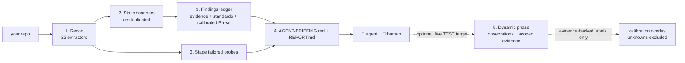

# Architecture

<!-- docguard:version 0.9.0 -->
<!-- docguard:status approved -->
<!-- docguard:last-reviewed 2026-09-16 -->
<!-- docguard:owner @raccioly -->
<!-- docguard:quality negation-load off — this tool is defined by what it deliberately omits (no LLM, no server, no running app, no runtime deps, no database); the negations describe real architectural properties, not phrasing defects. -->

> **Canonical document** — Design intent. This file describes WHAT the system is designed to be.
> ⚠️ Changes to this file require review. Update `DRIFT-LOG.md` if code deviates.

| Metadata | Value |
|----------|-------|
| **Status** |  |
| **Version** | `0.9.0` |
| **Last Updated** | 2026-09-14 |
| **Owner** | @raccioly |

---

## System Overview

`websec-validator` is a **local-first security-recon CLI that briefs an AI coding agent**. It does the
deterministic half a machine is good at — read the whole repo, map the full attack surface, run and
de-duplicate the static scanners it finds, and stage a probe library tailored to what it discovered —
then emits an `AGENT-BRIEFING.md` an agent (Claude Code, Codex, Gemini, Cursor) executes with a human
in the loop. **Code in, artifacts out: the core pass contains no LLM/server and needs no running app**
for its core pass. It is *not* an autonomous scanner and *not* a SaaS — it is the precise front-half
that makes the agent + human dramatically more effective.

## Component Map

The tool is a single pure-Python package, `src/websec_validator/`. Recon walks the repo **once** into a
shared `RepoContext`, then runs 22 extractors over it; the downstream modules turn those facts into
scanner runs, a calibrated findings ledger, staged probes, and the briefing/report artifacts.

| Component | Responsibility | Location | Tests |
|-----------|---------------|----------|-------|
| CLI entry point | Arg parsing + the `run` (with `--format`/`--fail-on`/`--baseline`) / `doctor` / `dynamic` / `mcp` commands (and hidden `recon` / `proof` / `calibrate`) | `src/websec_validator/cli.py` | `tests/test_recon.py`, `tests/test_hardening.py` |
| Recon driver | Thin wrapper that runs the extractor registry over one repo walk | `src/websec_validator/recon.py` | `tests/test_recon.py` |
| Extractors (22) | One focused question each → the merged `FACTS.json` (stack, routes, auth, authz, **authz_dataflow**, tenant, password_policy, surface, schemas, iac_ci, client_exposure, client_integrity, transport_security, graphql, upload_security, pii_exposure, integrations, **llm_security**, **crypto_usage**, **webext**, **agent_config**, **offline_deps**) | `src/websec_validator/extractors/` | `tests/test_recon.py`, `tests/test_pentest_regressions.py`, `tests/test_entitlement_webext.py` |
| Static scanners | Detect + (with `--scan`) shell out to Trivy/Gitleaks/Semgrep/Checkov/Prowler and de-duplicate across tools | `src/websec_validator/scanners.py` | `tests/test_recon.py` |
| Findings ledger | Correlate recon + static + dynamic into one ranked, standards-cited, calibrated record set | `src/websec_validator/findings.py` | `tests/test_pentest_regressions.py` |
| Analysis scope | Narrow what is READ AND MATCHED to named files while still walking the whole tree, so classification is unchanged | `src/websec_validator/extractors/base.py` | `tests/test_analysis_scope.py` |
| Agent-loop gate | Fast scoped pass/fail on the files just changed; writes nothing, publishes nothing, never advances a baseline | `src/websec_validator/gate.py` | `tests/test_gate_command.py` |
| PostToolUse hook | Run the gate on each file an agent writes and block the loop on a finding; fails open, loudly | `src/websec_validator/agenthook.py` | `tests/test_agent_hook.py` |
| Dependency existence | Opt-in registry check for hallucinated/removed packages, with offline suppression applied before any request | `src/websec_validator/registry.py` | `tests/test_registry_existence.py` |
| Audit evidence | Project an existing run into a per-control table, gaps first; no verdict, no score, no badge | `src/websec_validator/attest.py` | `tests/test_attest.py` |
| Run attribution | Which change a finding set describes, graded ci-minted / vcs-observed / self-asserted | `src/websec_validator/attribution.py` | `tests/test_attribution.py` |
| Calibration (CJE) | Wilson-interval `P(real)` per `(attack-class, confidence)` bucket; self-improving local overlay | `src/websec_validator/calibration.py` | `tests/test_recon.py` |
| Probe staging | Choose + stage the probe templates that match the extracted surface | `src/websec_validator/probes.py` | `tests/test_recon.py` |
| Briefing / Report | Render `AGENT-BRIEFING.md` (marching orders) and `REPORT.md` (immutable run record) | `src/websec_validator/briefing.py`, `report.py` | `tests/test_recon.py` |
| Machine formats | Render the ledger as **SARIF 2.1.0** (`results.sarif`, for GitHub Code Scanning) and a versioned JSON envelope; carries `schema_version` | `src/websec_validator/formats.py` | `tests/test_formats.py` |
| Baseline / diff | Fingerprint V2 + V1 aliases; new/unchanged/changed/reopened/no-longer-observed lifecycle; gate new, changed, reopened findings | `src/websec_validator/baseline.py` | `tests/test_formats.py` |
| MCP server | Typed stdio tools and authenticated loopback-only HTTP; approved root identities, framing/body limits, bounded workers and absolute receive deadline | `src/websec_validator/mcp_server.py` | `tests/test_formats.py` |
| Named profiles | Nine explicit check catalogs and manifest-based service boundaries; native analysis remains manual | `src/websec_validator/extractors/profiles.py` | `tests/test_profiles.py` |
| Intelligence | Explicit public-feed refresh, validated snapshots and offline known-CVE reassessment | `src/websec_validator/intel.py` | `tests/test_intel.py` |
| Research | Data-only proposal evaluation against shipped detectors; human-review promotion | `src/websec_validator/research.py` | `tests/test_research.py` |
| Explain | Offline lookup for an attack class or CWE id: citations, what would confirm or refute it, the remediation pattern and whether a calibrated cell exists. Reads the shipped STANDARDS/REMEDIATION/calibration data, so there is no second source of truth | `src/websec_validator/explain.py` | `tests/test_explain.py` |
| Provenance | Classifies how the running engine was installed — index, local file, editable, VCS or source tree — from PEP 610 `direct_url.json` and the metadata directory, with no network. `doctor` prints it because a version string alone does not identify the engine | `src/websec_validator/provenance.py` | `tests/test_provenance.py` |
| Feedback | Operator verdict that a detector is wrong; metadata-only record appended to `websec-out/feedback.jsonl` plus a printed issue link. Offline: builds a URL, sends nothing. Distinct from `.websec-ignore`, which suppresses locally and is never written here | `src/websec_validator/feedback.py` | `tests/test_feedback.py` |
| Coverage | Execution outcomes, read losses, scope limitations and actual analyzed-input/detector digests | `src/websec_validator/coverage.py` | `tests/test_coverage.py` |
| Repair evidence | Build-bound remediation plans and offline validation of contained, hashed before/after test artifacts | `src/websec_validator/repairs.py` | `tests/test_lifecycle.py`, `tests/test_coverage.py` |
| Output schemas | Published JSON Schemas for FACTS + ledger, versioned in lockstep with `formats.SCHEMA_VERSION` | `src/websec_validator/schemas/` | — |
| Constitution | Derive Given/When/Then security invariants → `CONSTITUTION.md` | `src/websec_validator/constitution.py` | `tests/test_recon.py` |
| Dynamic phase | Optional, gated live probing against a TEST instance (read-only BOLA, unauth reachability, localhost write-verb) | `src/websec_validator/dynamic.py` | `tests/test_hardening.py` |
| Proof harness | Score recon coverage against the labeled vuln-app corpus (VAmPI/NodeGoat/DVGA) | `src/websec_validator/proof.py` | `tests/test_recon.py` |
| Probe templates (22) | Scaffolds staged into the target's `probes/` for the agent + human to fill and run | `src/websec_validator/templates/probes/` | — (end-user scaffolding) |

### Feedback record redaction

A finding points at security-relevant code, so `feedback` is metadata-only by default: stable
identity (fingerprint, aliases, version, `identity_precision`), classification (`attack_class`,
`category`, `rule_id`, `severity`, `confidence`), calibration provenance, public standards
citations, and the file **extension** alone. Titles, routes, `location`, file paths, `method`,
`service_id` and evidence prose are withheld, because each can carry target structure or, for a
secret finding, the secret itself. `--include-snippet` adds the contextual fields, records
`"redaction": "with-context"` so a reader can tell which records were widened, shows the operator
the exact record first, and refuses without `--yes` when stdin is not a terminal. The record shape
is versioned by its `schema_version` field; no JSON Schema is shipped because nothing in the
package validates it at runtime.

## Layer Boundaries

The package is a pipeline, not a layered service. The ordering constraints that prevent drift:

| Stage | Reads | Must run after |
|-------|-------|----------------|
| `stack` extractor | the raw repo | nothing (runs first; others read `facts['stack']`) |
| `routes` extractor | the raw repo | `stack` |
| `authz` extractor | `facts['routes']` | `routes` |
| all other extractors | `facts['stack']` (+ their own files) | `stack` |
| scanners / probes / ledger / briefing | the merged `FACTS.json` | all extractors |
| dynamic phase | a prior run's `FACTS.json` + a live TEST target | a `run` (or `--facts`) |

Adding a dimension = drop a module in `extractors/` and append it to `REGISTRY` in
`extractors/__init__.py`. That is the whole extension model.

## Tech Stack

| Category | Technology | Version | License |
|----------|-----------|---------|---------|
| Language | Python | 3.11+ | — |
| Runtime deps | **none** (stdlib only) | — | — |
| Packaging | setuptools (`pyproject.toml`) | ≥68 | MIT |
| Route engine | OWASP Noir (external, optional) | latest | shelled out, not imported |
| Static scanners | Trivy, Gitleaks, Semgrep/OpenGrep, Checkov, Prowler | — | shelled out when present |
| Database | none | — | — |
| Auth | core CLI has no accounts; HTTP MCP requires bearer token and approved roots | — | loopback-only optional transport |
| Hosting | none — runs locally / in CI / in Docker | — | — |
| CI/CD | GitHub Actions (test + Trusted-Publishing to PyPI) | — | — |

## External Dependencies

The tool **shells out** to these when present and degrades gracefully when absent (reports what is
missing with an install hint, never hard-fails). None are Python imports — there are zero runtime
package dependencies.

| Tool | Purpose | Fallback |
|------|---------|----------|
| OWASP Noir | route engine (50+ frameworks) | built-in regex route extractor |
| Gitleaks | committed-secret detection | scanner reported missing |
| Trivy | dependency CVEs | scanner reported missing |
| Semgrep / OpenGrep | code-level SAST (ships 2 bundled rules) | scanner reported missing |
| Checkov | IaC misconfiguration | scanner reported missing |
| Prowler | cloud-account posture | scanner reported missing |
| Docker | reproducible all-scanners-bundled run | run natively with whatever is installed |

## Configuration Files

| File | Purpose |
|------|---------|
| `pyproject.toml` | Single source of truth for name, version, entry point, and packaged data |
| `.websec-ignore` | Per-target suppressions for the findings ledger (glob paths or `category:<x>`) |
| `dynamic-config.example.json` | Template for the dynamic phase's TEST target + role credentials (copy to a gitignored `dynamic-config.json`) |
| `.docguard.json` / `.docguardignore` | DocGuard (CDD) config: which docs are canonical and which paths to exclude from doc validation (e.g. `tests/fixtures/`, the probe templates) |
| `Dockerfile` / `.dockerignore` | The all-scanners-bundled image (arch-aware, amd64 + arm64) |

## Infrastructure (IaC)

Not applicable. `websec-validator` ships no cloud infrastructure of its own — it is a local CLI and a
Claude Code plugin. (It *detects and reasons about* AWS CDK / AppSync / VTL in the **target** repos it
scans, but uses none itself.)

## Output Artifacts (`websec-out/`)

Every attempt reserves a unique directory (`websec-out/runs/<timestamp>-<unique>/`). Only after
all artifacts of a completed execution are written does an atomic symlink replacement publish
`latest`. Partial attempts retain their artifacts and preserve the prior completed pointer.

| Artifact | What it is |
|----------|------------|
| `AGENT-BRIEFING.md` | **The product.** Marching orders for the AI agent. |
| `FACTS.json` | Structured recon and coverage (schema 2.0). |
| `coverage.json` | Extractor/scanner outcomes, file read/cap losses, selected scope, analyzed-input and detector digests. |
| `repair-plans.json` | Original finding/build/scope binding and proposed positive/negative verification requirements. |
| `findings.json` | Static scanner results, de-duplicated across tools (with `--scan`). |
| `findings-ledger.json` / `REPORT.md` | The traceable ledger: evidence chain, CWE/ASVS/OWASP-API citation, remediation, calibrated `P(real)`. |
| `CONSTITUTION.md` | Security invariants as checkable Given/When/Then. |
| `probes/` | The probe scripts selected + staged for *this* app. |
| `manifest.json` | Machine-readable index of the run. |

## Diagrams

---

## Revision History

| Version | Date | Author | Changes |
|---------|------|--------|---------|
| 0.4.1 | 2026-06-10 | @raccioly | Canonical architecture documented from the shipped v0.4.1 tree |
| 0.7.0 | 2026-06-22 | @raccioly | Re-synced after the self-improvement wave: router-mount-auth modeling + the FP-killer pass; **2 new extractors** (`llm_security` — OWASP LLM Top 10; `crypto_usage`) → 18 |
| 0.8.0 | 2026-06-22 | @raccioly | Deferred-backlog detectors: **1 new extractor** (`authz_dataflow` — unsigned-cookie / claim-keyed / transaction-local-RLS authz correctness) → 19; plus CORS/SRI/host-redirect/SSRF-redirect classes in existing extractors |

## Execution, Identity and Read Contracts

`RepoContext` owns contained, excluded, bounded regular-file reads and a pruned inventory. It records
inputs only after successful reads; OpenAPI uses that same context and implicit graph reads honor
target exclusions. Explicit external graph input gets a distinct origin namespace in the digest.
Extractor errors remain isolated, but they make requested execution incomplete. Scanner report
read/parse failures and explicitly requested unavailable adapters have the same effect. Optional
unselected tools are scope limitations. `execution_complete` never means full vulnerability coverage.

Facts, ledger and envelope use schema 2.0; SARIF remains 2.1.0 and uses its standard lifecycle enum.
The detector revision hashes shipped implementation/rule data, including dirty source content, and
is separate from the installed package version. External scanner versions are recorded when their
reports supply them; absent version metadata remains unverified.

Fingerprint V2 describes semantic finding identity; display titles/line shifts do not define it.
Disappearance does not establish repair. Repair verification binds original and fixed contexts plus
unchanged scope, policy and detector revision, then validates operator-supplied reports without
executing them. Calibration admits only evidence-backed labels; unknowns and legacy unproven data
are kept out of measured success counts.

## External Analysis and Bounded Source Intake

`sarif_ingest.py` accepts explicit SARIF 2.1.0 reports as data. It validates protocol references and
outcomes, normalizes native identities and ordered traces, and supplies per-report coverage metadata.
The CLI preserves `sarif-imports.json`, merges active imported leads into the complete ledger and
exports native rule descriptions separately from generic recon classes. Analyzer success, import
success and current-source freshness are distinct facts; report hashes never replace source hashes.
This integrates specialist analyzers without building or executing the target project.

`RepoContext` bounds retained raw source cache payloads per context and records read-policy limits
alongside actual source byte counts. Aliases reuse content while contributing separate analyzed path
identities. File inventories cache relative-path computation only; authorization, resolved targets
and current file state are still checked at access time. External artifact readers have separate caps.

SCA identities include manifest, ecosystem, package and installed version. Updating a still-affected
version can therefore produce a new occurrence; the old one is only no longer observed, never marked
verified fixed. Native advisory aliases remain separate from fingerprint migration aliases.
Checkov errors and contradictory counts retain usable findings while preventing complete execution.
Bandit is optional and preserves confidence independently of severity and CWE classification.

## Framework and agent adoption boundaries

Stack inventory uses validated manifest metadata and service roots, including Rust workspaces.
Declared frameworks do not establish deployment; React/native JSX alone is not a browser renderer.
The bounded Django URL parser follows supported local bindings without importing target modules.
Unknown roots/mounts remain attributed candidates and explicit gaps.

The multi-host installer owns dedicated skills only with known generated headers, and shared files
only within one complete managed region. Foreign or ambiguous content is refused before mutation.
Generated guidance and the shipped skill share a current-attempt selector: JSON envelope generated
id, contained non-symlink run directory, visible completion/provenance and no stale latest fallback.

The shipped research suite catalog is data-only. Explicit suite evaluation runs every proposal,
retains individual and aggregate verdicts, and rejects empty, failed or revision-inconsistent runs.
Local adoption is configuration around existing entrypoints: pre-commit invokes the installed CLI,
native hooks retain their existing advisory/gate roles, and hosted examples reuse the composite
Action. None of these documentation artifacts activates a scheduler or hook automatically.

Assigned Python query analysis is a bounded syntax pass under the surface extractor. It carries
request and assignment-line evidence into distinct sink occurrences, keeps bound parameters
separate from raw query text, and reports parser/work losses. It does not execute Python or resolve
a cross-function call graph. Loops receive one may-flow pass and explicit later-iteration gaps.
