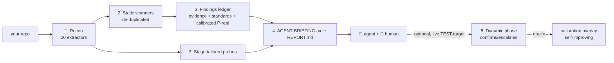

# Architecture

<!-- docguard:version 0.9.0 -->
<!-- docguard:status approved -->
<!-- docguard:last-reviewed 2026-07-02 -->
<!-- docguard:owner @raccioly -->
<!-- docguard:quality negation-load off — this tool is defined by what it deliberately omits (no LLM, no server, no running app, no runtime deps, no database); the negations describe real architectural properties, not phrasing defects. -->

> **Canonical document** — Design intent. This file describes WHAT the system is designed to be.  
> ⚠️ Changes to this file require review. Update `DRIFT-LOG.md` if code deviates.

| Metadata | Value |
|----------|-------|
| **Status** |  |
| **Version** | `0.8.0` |
| **Last Updated** | 2026-06-22 |
| **Owner** | @raccioly |

---

## System Overview

`websec-validator` is a **local-first security-recon CLI that briefs an AI coding agent**. It does the
deterministic half a machine is good at — read the whole repo, map the full attack surface, run and
de-duplicate the static scanners it finds, and stage a probe library tailored to what it discovered —
then emits an `AGENT-BRIEFING.md` an agent (Claude Code, Codex, Gemini, Cursor) executes with a human
in the loop. **Code in, artifacts out: it contains no LLM, runs no server, and needs no running app**
for its core pass. It is *not* an autonomous scanner and *not* a SaaS — it is the precise front-half
that makes the agent + human dramatically more effective.

## Component Map

The tool is a single pure-Python package, `src/websec_validator/`. Recon walks the repo **once** into a
shared `RepoContext`, then runs 20 extractors over it; the downstream modules turn those facts into
scanner runs, a calibrated findings ledger, staged probes, and the briefing/report artifacts.

| Component | Responsibility | Location | Tests |
|-----------|---------------|----------|-------|
| CLI entry point | Arg parsing + the `run` (with `--format`/`--fail-on`/`--baseline`) / `doctor` / `dynamic` / `mcp` commands (and hidden `recon` / `proof` / `calibrate`) | `src/websec_validator/cli.py` | `tests/test_recon.py`, `tests/test_hardening.py` |
| Recon driver | Thin wrapper that runs the extractor registry over one repo walk | `src/websec_validator/recon.py` | `tests/test_recon.py` |
| Extractors (20) | One focused question each → the merged `FACTS.json` (stack, routes, auth, authz, **authz_dataflow**, tenant, password_policy, surface, schemas, iac_ci, client_exposure, client_integrity, transport_security, graphql, upload_security, pii_exposure, integrations, **llm_security**, **crypto_usage**, **webext**) | `src/websec_validator/extractors/` | `tests/test_recon.py`, `tests/test_pentest_regressions.py`, `tests/test_entitlement_webext.py` |
| Static scanners | Detect + (with `--scan`) shell out to Trivy/Gitleaks/Semgrep/Checkov/Prowler and de-duplicate across tools | `src/websec_validator/scanners.py` | `tests/test_recon.py` |
| Findings ledger | Correlate recon + static + dynamic into one ranked, standards-cited, calibrated record set | `src/websec_validator/findings.py` | `tests/test_pentest_regressions.py` |
| Calibration (CJE) | Wilson-interval `P(real)` per `(attack-class, confidence)` bucket; self-improving local overlay | `src/websec_validator/calibration.py` | `tests/test_recon.py` |
| Probe staging | Choose + stage the probe templates that match the extracted surface | `src/websec_validator/probes.py` | `tests/test_recon.py` |
| Briefing / Report | Render `AGENT-BRIEFING.md` (marching orders) and `REPORT.md` (immutable run record) | `src/websec_validator/briefing.py`, `report.py` | `tests/test_recon.py` |
| Machine formats | Render the ledger as **SARIF 2.1.0** (`results.sarif`, for GitHub Code Scanning) and a versioned JSON envelope; carries `schema_version` | `src/websec_validator/formats.py` | `tests/test_formats.py` |
| Baseline / diff | Stable per-finding fingerprint + `new`/`unchanged`/`fixed` diff vs a prior ledger, so `--fail-on` gates only on NEW findings | `src/websec_validator/baseline.py` | `tests/test_formats.py` |
| MCP server | Expose recon as typed MCP tools over stdio (raw JSON-RPC 2.0, stdlib) for any MCP client — `websec mcp` | `src/websec_validator/mcp_server.py` | `tests/test_formats.py` |
| Output schemas | Published JSON Schemas for FACTS + ledger, versioned in lockstep with `formats.SCHEMA_VERSION` | `src/websec_validator/schemas/` | — |
| Constitution | Derive Given/When/Then security invariants → `CONSTITUTION.md` | `src/websec_validator/constitution.py` | `tests/test_recon.py` |
| Dynamic phase | Optional, gated live probing against a TEST instance (read-only BOLA, unauth reachability, localhost write-verb) | `src/websec_validator/dynamic.py` | `tests/test_hardening.py` |
| Proof harness | Score recon coverage against the labeled vuln-app corpus (VAmPI/NodeGoat/DVGA) | `src/websec_validator/proof.py` | `tests/test_recon.py` |
| Probe templates (22) | Scaffolds staged into the target's `probes/` for the agent + human to fill and run | `src/websec_validator/templates/probes/` | — (end-user scaffolding) |

## Layer Boundaries

The package is a pipeline, not a layered service. The ordering constraints that prevent drift:

| Stage | Reads | Must run after |
|-------|-------|----------------|
| `stack` extractor | the raw repo | nothing (runs first; others read `facts['stack']`) |
| `routes` extractor | the raw repo | `stack` |
| `authz` extractor | `facts['routes']` | `routes` |
| all other extractors | `facts['stack']` (+ their own files) | `stack` |
| scanners / probes / ledger / briefing | the merged `FACTS.json` | all extractors |
| dynamic phase | a prior run's `FACTS.json` + a live TEST target | a `run` (or `--facts`) |

Adding a dimension = drop a module in `extractors/` and append it to `REGISTRY` in
`extractors/__init__.py`. That is the whole extension model.

## Tech Stack

| Category | Technology | Version | License |
|----------|-----------|---------|---------|
| Language | Python | 3.11+ | — |
| Runtime deps | **none** (stdlib only) | — | — |
| Packaging | setuptools (`pyproject.toml`) | ≥68 | MIT |
| Route engine | OWASP Noir (external, optional) | latest | shelled out, not imported |
| Static scanners | Trivy, Gitleaks, Semgrep/OpenGrep, Checkov, Prowler | — | shelled out when present |
| Database | none | — | — |
| Auth | none (no users, no server) | — | — |
| Hosting | none — runs locally / in CI / in Docker | — | — |
| CI/CD | GitHub Actions (test + Trusted-Publishing to PyPI) | — | — |

## External Dependencies

The tool **shells out** to these when present and degrades gracefully when absent (reports what is
missing with an install hint, never hard-fails). None are Python imports — there are zero runtime
package dependencies.

| Tool | Purpose | Fallback |
|------|---------|----------|
| OWASP Noir | route engine (50+ frameworks) | built-in regex route extractor |
| Gitleaks | committed-secret detection | scanner reported missing |
| Trivy | dependency CVEs | scanner reported missing |
| Semgrep / OpenGrep | code-level SAST (ships 2 bundled rules) | scanner reported missing |
| Checkov | IaC misconfiguration | scanner reported missing |
| Prowler | cloud-account posture | scanner reported missing |
| Docker | reproducible all-scanners-bundled run | run natively with whatever is installed |

## Configuration Files

| File | Purpose |
|------|---------|
| `pyproject.toml` | Single source of truth for name, version, entry point, and packaged data |
| `.websec-ignore` | Per-target suppressions for the findings ledger (glob paths or `category:<x>`) |
| `dynamic-config.example.json` | Template for the dynamic phase's TEST target + role credentials (copy to a gitignored `dynamic-config.json`) |
| `.docguard.json` / `.docguardignore` | DocGuard (CDD) config: which docs are canonical and which paths to exclude from doc validation (e.g. `tests/fixtures/`, the probe templates) |
| `Dockerfile` / `.dockerignore` | The all-scanners-bundled image (arch-aware, amd64 + arm64) |

## Infrastructure (IaC)

Not applicable. `websec-validator` ships no cloud infrastructure of its own — it is a local CLI and a
Claude Code plugin. (It *detects and reasons about* AWS CDK / AppSync / VTL in the **target** repos it
scans, but uses none itself.)

## Output Artifacts (`websec-out/`)

Every `run` writes an **immutable, timestamped** directory (`websec-out/runs/<ts>/`) with a `latest`
symlink — nothing is ever overwritten.

| Artifact | What it is |
|----------|------------|
| `AGENT-BRIEFING.md` | **The product.** Marching orders for the AI agent. |
| `FACTS.json` | The full structured recon. |
| `findings.json` | Static scanner results, de-duplicated across tools (with `--scan`). |
| `findings-ledger.json` / `REPORT.md` | The traceable ledger: evidence chain, CWE/ASVS/OWASP-API citation, remediation, calibrated `P(real)`. |
| `CONSTITUTION.md` | Security invariants as checkable Given/When/Then. |
| `probes/` | The probe scripts selected + staged for *this* app. |
| `manifest.json` | Machine-readable index of the run. |

## Diagrams

---

## Revision History

| Version | Date | Author | Changes |
|---------|------|--------|---------|
| 0.4.1 | 2026-06-10 | @raccioly | Canonical architecture documented from the shipped v0.4.1 tree |
| 0.7.0 | 2026-06-22 | @raccioly | Re-synced after the self-improvement wave: router-mount-auth modeling + the FP-killer pass; **2 new extractors** (`llm_security` — OWASP LLM Top 10; `crypto_usage`) → 18 |
| 0.8.0 | 2026-06-22 | @raccioly | Deferred-backlog detectors: **1 new extractor** (`authz_dataflow` — unsigned-cookie / claim-keyed / transaction-local-RLS authz correctness) → 19; plus CORS/SRI/host-redirect/SSRF-redirect classes in existing extractors |
